<a id="chemtools" style="width:0;height:0;margin:0;padding:0;">&zwnj;</a>

# ChemTools

ChemTools implements a suite of chemistry-oriented functionality, including a simple data framework, an object-oriented chemical modeling system, and a number of computational utilities on raw sets of atom and bonded systems

---

<a id="installation" style="width:0;height:0;margin:0;padding:0;">&zwnj;</a>

## Installation

The easiest way to install  ```ChemTools```  is using a paclet server installation:

```mathematica
 PacletInstall[
 "ChemTools",
 "Site"->
  "http://www.wolframcloud.com/objects/b3m2a1.paclets/PacletServer"
 ]
```

If you've already installed it you can update using:

```mathematica
 PacletUpdate[
 "ChemTools",
 "Site"->
  "http://www.wolframcloud.com/objects/b3m2a1.paclets/PacletServer"
 ]
```

Alternately you can download this repo as a ZIP file and put extract it in  ```$UserBaseDirectory/Applications```

---

### ChemTools has been entirely refactored

Many functions now live in subcontexts so as to not unnecessarily clutter the global namespace

The things you can currently run are

* ```<<ChemTools`All` ```

* ```<<ChemTools`Objects` ```

  * ```<<ChemTools`Objects`ObjectFramework` ```

  * ```<<ChemTools`Objects`Utilities` ```

  * ```<<ChemTools`Objects`Atom` ```

  * ```<<ChemTools`Objects`Bond` ```

  * ```<<ChemTools`Objects`Atomset` ```

* ```<<ChemTools`Utilities` ```

* ```<<ChemTools`Data` ```

* ```<<ChemTools`DVR` ```

* ```<<ChemTools`Experimental` ```

* ```<<ChemTools`Psi4` ```

* ```<<ChemTools`OpenBabel` ```

* ```<<ChemTools`SP` ```

---

<a id="objectoriented-chemistry" style="width:0;height:0;margin:0;padding:0;">&zwnj;</a>

## Object-Oriented Chemistry

### Packages

* [Objects](Packages/Objects.)

### Description

[Objects.m](Packages/Objects.m)  provides an object-oriented framework for chemical modeling and import. A rundown of the way it was built can be found  [here](https://www.wolframcloud.com/objects/b3m2a1/home/-pretend-chemistry-and-fake-objects.html) . The core data-types it provides are atoms, bonds, and atom sets. It integrates with a number of the other packages, such as  [Utilities](Packages/Utilities.m)  and  [Psi4Connection](Packages/Psi4Connection.m)  to provide richer computational tools.

### Examples

Import a molecule from PubChem:

    ChemImport[methyloxirane]//ChemView

    (*Out:*)
    
    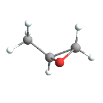

Calculate the Gasteiger-charge based electric potential:

    AtomsetElectricPotentialMap[methyloxirane]

    (*Out:*)
    
    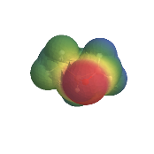

Plot the first molecular orbital:

    AtomsetOrbitalsPlot[methyloxirane,
     "Orbitals"->1
     ]

    (*Out:*)
    
    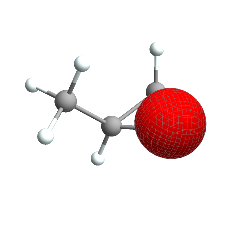

---

<a id="data-framework" style="width:0;height:0;margin:0;padding:0;">&zwnj;</a>

## Data Framework

### Packages

* [DataFramework](Packages/DataFramework.m)

### Description

[DataFramework.m](Packages/DataFramework.m)  implements a simple, cached data-lookup system for a collection of different data types. It provides object-oriented access to data in a somewhat similar way to the built-in  [```EntityFramework```](https://www.wolframcloud.com/objects/b3m2a1.paclets/reference/EntityFramework/guide/EntityFramework.html) .  [Objects.m](Packages/Objects.m)  integrates with the data framework to provide atomic radii, standard bond distances, chemical structures, etc.

### Examples

Lookup the SDF file for ethane:

    ethaneSDF=ChemDataLookup["Ethane","SDFFiles"];
    StringSplit[ethaneSDF,"M  END"->"M END"][[;;2]]//StringJoin

<pre class="program"><code style="width: 100%; white-space: pre-wrap;">-----------Out-----------
"6324\n  -OEChem-09171715583D\n\n  8  7  0     0  0  0  0  0  0999 V2000\n   -0.7560    0.0000    0.0000 C   0  0  0  0  0  0  0  0  0  0  0  0\n    0.7560    0.0000    0.0000 C   0  0  0  0  0  0  0  0  0  0  0  0\n   -1.1404    0.6586    0.7845 H   0  0  0  0  0  0  0  0  0  0  0  0\n   -1.1404    0.3501   -0.9626 H   0  0  0  0  0  0  0  0  0  0  0  0\n   -1.1405   -1.0087    0.1781 H   0  0  0  0  0  0  0  0  0  0  0  0\n    1.1404   -0.3501    0.9626 H   0  0  0  0  0  0  0  0  0  0  0  0\n    1.1405    1.0087   -0.1781 H   0  0  0  0  0  0  0  0  0  0  0  0\n    1.1404   -0.6586   -0.7845 H   0  0  0  0  0  0  0  0  0  0  0  0\n  1  2  1  0  0  0  0\n  1  3  1  0  0  0  0\n  1  4  1  0  0  0  0\n  1  5  1  0  0  0  0\n  2  6  1  0  0  0  0\n  2  7  1  0  0  0  0\n  2  8  1  0  0  0  0\nM END"</code></pre>

List the standard data sources:

    $ChemDataSources//Keys

    (*Out:*)
    
    {"AtomColors","BondDistances","UnitConversions","SpaceGroups","ElementValences","PubChemIDs","PubChemNames","ComponentIDs","ParentIDs","SimilarIDs","2DStructures","SDFFiles","PrimaryIsotope","StandardName","Symbol","Radius","Mass"}

---

<a id="computational-utilities" style="width:0;height:0;margin:0;padding:0;">&zwnj;</a>

## Computational Utilities

### Packages

* [Utilities](Packages/Utilities.m)

### Description

[Utilities.m](Packages/Utilities.m)  provides a collection of simple utilities that operate largely on a collection of atoms and bonds.  [Objects.m](Packages/Objects.m)  makes extensive use of  [Utilities.m](Packages/Utilities.m)  to provide methods of atomsets.

### Examples

Compute the principal-axes system of the carbons in benzene:

    carbons=Cases[AtomsetElementPositions@ChemImport[benzene],{"C",_}];
    ChemUtilsInertialSystem[carbons]

    (*Out:*)
    
    <|"A"->7209.127234581451`,"B"->7208.632730555107`,"C"->3604.4399973361847`,"AAxis"->{0.9414139786613454`,-0.3372531994480984`,-0.000015589650459000938`},"BAxis"->{-0.33725319916790675`,-0.941413978716536`,0.000018113904361426377`},"CAxis"->{0.00002078528706579606`,0.000011795023282774009`,0.9999999997144247`},"Units"->|>

Note that this is already included in  [Objects.m](Packages/Objects.m)  for atomset objects:

    AtomsetInertialSystem[benzene]

    (*Out:*)
    
    <|"A"->5696.661207979451`,"B"->5696.2792241823145`,"C"->2848.235112634813`,"AAxis"->{-0.9485439223225567`,0.3166455861727259`,0.000013500754698756227`},"BAxis"->{-0.3166455860356584`,-0.9485439223963544`,0.000011361021309422724`},"CAxis"->{0.000016403476069312236`,6.501473330918647`*^-6,0.9999999998443284`},"Units"->|>

Get the 1s hydrogen orbital:

    ChemHOrbital[1,0][x,y,z]

<pre >
<code>
0.08160109605654272057146474567309614521`8.94544988238545 E<sup>-0.94486306272891408793240976253727402777`9.343389891057488 x</sup> x (10.`9.343389891057488-9.4486306272891408794`9.343389891057488 x+1.7855324146189276774`9.343389891057488 x<sup>2</sup>) Cos[y]
</code>
</pre>

Get the isotopologues of vinyl chloride with greater than 1% relative abundance:

    atoms=AtomsetElementPositions@ChemImport["vinyl chloride"];
    ChemUtilsIsotopologues[atoms,.01]

    (*Out:*)
    
    <|{{"Chlorine35",{-1.4203`,0.1932`,0.`}},{"Carbon12",{0.158`,-0.4694`,0.`}},{"Carbon12",{1.2623`,0.2762`,0.`}},{"Hydrogen1",{0.1621`,-1.5509`,-0.0001`}},{"Hydrogen1",{2.2396`,-0.1941`,0.`}},{"Hydrogen1",{1.2208`,1.36`,0.`}}}->0.74063902864283962`3.4814860601221125,{{"Chlorine37",{-1.4203`,0.1932`,0.`}},{"Carbon12",{0.158`,-0.4694`,0.`}},{"Carbon12",{1.2623`,0.2762`,0.`}},{"Hydrogen1",{0.1621`,-1.5509`,-0.0001`}},{"Hydrogen1",{2.2396`,-0.1941`,0.`}},{"Hydrogen1",{1.2208`,1.36`,0.`}}}->0.2368441819191765244`3.4814860601221125|>

Note that these are all implemented in  top-level Mathematica code, and some may not operate well on large systems. For instance, computing symmetry elements gets prohibitively slow for larger systems:

    ChemImport[water];
    ChemUtilsSymmetryGraphics[AtomsetElementPositions@water]//AbsoluteTiming

    (*Out:*)
    
    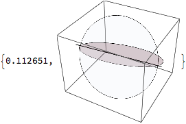

    ChemUtilsSymmetryGraphics[AtomsetElementPositions@benzene]//AbsoluteTiming

    (*Out:*)
    
    

This can be accelerated by only considering the heavy atoms. The atom set version provides that as a default:

    ChemView[benzene, "SymmetryElements"->All]//AbsoluteTiming

    (*Out:*)
    
    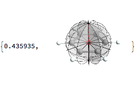

The algorithm depends on being able to reduce the problem by symmetry, though, so for unsymmetric systems, performance is negatively impacted:

    ChemView["phenylamine", "SymmetryElements"->All]//AbsoluteTiming

    (*Out:*)
    
    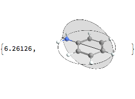

And for particularly large species it fails completely:

    buckyball=ChemImport["~/Downloads/110185.mol"];
    ChemView[buckyball, "SymmetryElements"->All]//AbsoluteTiming

    (*Out:*)
    
    SystemException["MemoryAllocationFailure"]

---

<a id="external-connections" style="width:0;height:0;margin:0;padding:0;">&zwnj;</a>

## External Connections

### Packages

* [Extensions](Packages/Extensions.m)

* [SymbolicPython](Packages/SymbolicPython)

* [Psi4Connection](Packages/Psi4)

* [SPConnection](Packages/SP)

* [OBConnection](Packages/OpenBabel)

### Description

ChemTools provides a number of connections to programs written by others (running via  [```ProcessObject```](https://reference.wolfram.com/language/ref/ProcessObject.html)  as opposed to  [```LibraryLink```](https://reference.wolfram.com/language/LibraryLink/tutorial/Overview.html) ) although this may change in the future. To make this easier it supplies  [SymbolicPython.m](Packages/SymbolicPython)  for passing python code to, e.g.  [OpenBabel](http://openbabel.org/api/2.3/) / [PyBel](https://openbabel.org/docs/dev/UseTheLibrary/Python_Pybel.html)  or  [Psi4.](http://www.psicode.org/)  Each connection provides a function for downloading and compiling. Generally these connections aren't necessarily intended to be used oneself, but are built to make use of within higher-level systems.

### Examples

Configure a simple scan in Psi4:

    Needs["ChemTools`Psi4`"];
    co=ChemImport["vinyl chloride"];
    coels=AtomsetElementPositions@co;
    com=ChemUtilsCenterOfMass@coels;
    scanels=
     Append[
      ChemUtilsGenerateZMatrix@Append[coels,{"X",com}],
      {"Ar",Length[coels]+1,3.1077,2,180,1,#}
      ];
    scan=Psi4EnergyScan[
     <|
      "Molecules"->scanels,
      "Scan"->{{0,180,60}},
      "Configuration"->{
       "BasisSet"->"cc-pvqz"
       }
      |>
     ]

    (*Out:*)
    
    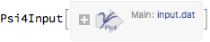

Extract the input file string:

    scan["input.dat"]//StringTrim

<pre class="program"><code style="width: 100%; white-space: pre-wrap;">-----------Out-----------
"molecule mol {\n\tCl\n\tC 1 1.71174\n\tC 2 1.33244 1 123.2\n\tH 3 2.13278 2 24.9191 1 179.994\n\tH 4 2.48131 3 25.7972 2 179.994\n\tH 5 1.85827 4 89.9012 3 0.00139191\n\tX 6 2.13237 5 85.8944 4 0.00226565\n\tAr 7 3.1077 2 180 1 pyVar_1\n\t}\n\nset  { basis cc-pvqz }\nfor pyVar_1 in range(0, 180, 60):\n\t[ mol_1.pyVar_1 ] = [ pyVar_1 ]\n\tenergy('scf')"</code></pre>

Find some of the properties of an  [OpenBabel molecule](http://openbabel.org/dev-api/classOpenBabel_1_1OBMol.shtml)  one can access:

    Needs["ChemTools`OpenBabel`"]
    importPyAsJSON=ImportString[StringReplace[#,{"'"->"\"","("->"[",")"->"]"}],"JSON"]&;
    OBPyRun["C-C",
    "pybelMol"."OBMol"//"dir"//Print
    ]//importPyAsJSON//RandomSample[#,10]&

    (*Out:*)
    
    {"HasPartialChargesPerceived","UnsetLSSRPerceived","ConvertZeroBonds","HasSSSRPerceived","UnsetImplicitValencePerceived","DeleteBond","Kekulize","NewPerceiveKekuleBonds","Clear","GetBond"}

Look at the pybel code generated to run this:

    OBPyCommand["C-C","pybelMol"."OBMol"//"dir"//Print]//StringTrim

<pre class="program"><code style="width: 100%; white-space: pre-wrap;">-----------Out-----------
"from __future__ import print_function\nimport openbabel, pybel\npybelLoadMolString = '''C-C'''\npybelLoadName = 'pybelMol'\npybelLoadFormat = 'SMILES'\npybelMol = pybel.readstring('SMILES', pybelLoadMolString)\npybelMol.inputString = pybelLoadMolString\npybelMol.inputFormat = pybelLoadFormat\npybelMol.inputName = pybelLoadName\n\n\nprint(dir(pybelMol.OBMol))"</code></pre>

Load a molecule in an interactive PyBel session:

    OBPyRun[ChemDataLookup["vinyl chloride", "SDFFiles"]->"vcl",
     Print[ "vcl" ],
     "Session"->True
     ]

    (*Out:*)
    
    "ClC=C\t6338"

Find at the coordinates of the atoms of the vinyl chloride in the session:

    OBPyRun[ChemDataLookup["vinyl chloride", "SDFFiles"]->"vcl",
     Print[ Map[#."coords"&, "vcl"."atoms" ]],
     "Session"->True
     ]//importPyAsJSON

    (*Out:*)
    
    {{-1.4203`,0.1932`,0.`},{0.158`,-0.4694`,0.`},{1.2623`,0.2762`,0.`},{0.1621`,-1.5509`,-0.0001`},{2.2396`,-0.1941`,0.`},{1.2208`,1.36`,0.`}}

---

<a id="discrete-variable-representations" style="width:0;height:0;margin:0;padding:0;">&zwnj;</a>

## Discrete Variable Representations

### Packages

* [DVR](Packages/DVR.m)

### Description

[DVR.m](Packages/DVR.m)  implements a framework for making and extending discrete variable representations, providing a basic object-oriented system for doing so. A few basic DVR classes have already been written which can be mixed and matched or used as it. Integration with  [Objects](Packages/Objects.m)  is forthcoming.

### Examples

Load a simple 1D DVR and run it:

    dvr=ChemDVRClass["Cartesian1DDVR"][{151}]

    (*Out:*)
    
    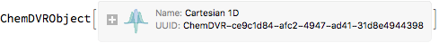

    dvr[Manipulate->False]

    (*Out:*)
    
    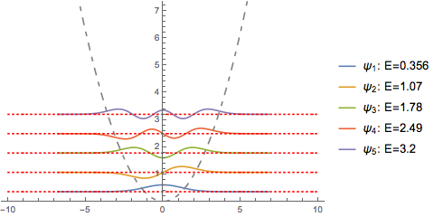

---

<a id="spectroscopy" style="width:0;height:0;margin:0;padding:0;">&zwnj;</a>

## Spectroscopy

### Packages

* [Spectroscopy](Packages/Spectroscopy.m)

### Description

[Spectroscopy](Packages/Spectroscopy.m)  provides simple tools for working with spectra. It was designed for integrating with the spfit / spcat system that is popular with microwave spectroscopists.

### Examples

Import a random JPL line list:

    spec=
     ChemSpectrumImport[
      TemplateApply["https://spec.jpl.nasa.gov/ftp/pub/catalog/c``001.cat",
       IntegerString[RandomInteger[50],10,3]
       ]
      ]

    (*Out:*)
    
    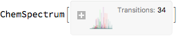

Plot it:

    ChemSpectrumPlot[spec]

    (*Out:*)
    
    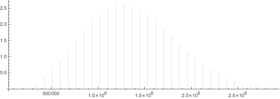

Start an interactive line picker

    ChemSpectrumLineSelector[spec]

    (*Out:*)
    
    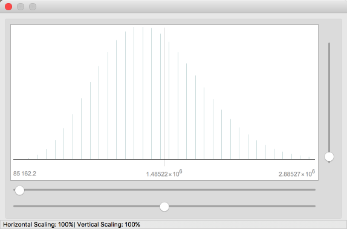