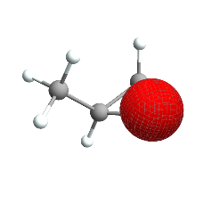
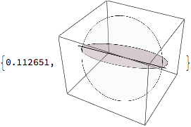
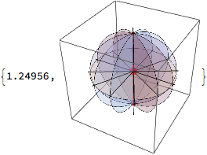
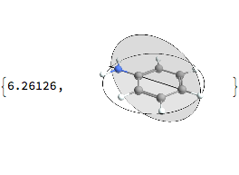
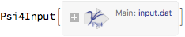
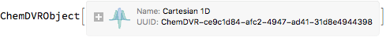
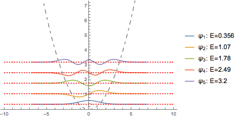
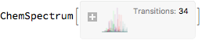
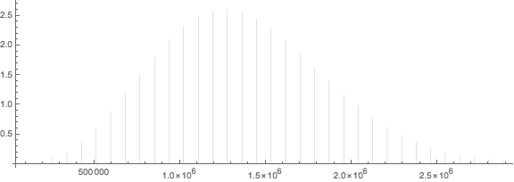
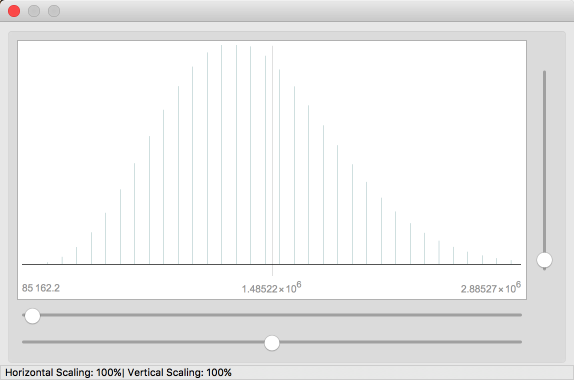

<a id="chemtools" style="width:0;height:0;margin:0;padding:0;">&zwnj;</a>

# ChemTools

ChemTools implements a suite of chemistry-oriented functionality, including a simple data framework, an object-oriented chemical modeling system, and a number of computational utilities on raw sets of atom and bonded systems

---

<a id="objectoriented-chemistry" style="width:0;height:0;margin:0;padding:0;">&zwnj;</a>

## Object-Oriented Chemistry

### Packages

* [Objects](Packages/Objects.)

### Description

[Objects.m](Packages/Objects.m)  provides an object-oriented framework for chemical modeling and import. A rundown of the way it was built can be found  [here](https://www.wolframcloud.com/objects/b3m2a1/home/-pretend-chemistry-and-fake-objects.html) . The core data-types it provides are atoms, bonds, and atom sets. It integrates with a number of the other packages, such as  [Utilities](Packages/Utilities.m)  and  [Psi4Connection](Packages/Psi4Connection.m)  to provide richer computational tools.

### Examples

Import a molecule from PubChem:

	ChemImport[methyloxirane] // ChemView

	(*Out:*)
	
 

Calculate the Gasteiger-charge based electric potential:

	AtomsetElectricPotentialMap[methyloxirane]

	(*Out:*)
	
 

Plot the first molecular orbital:

	AtomsetOrbitalsPlot[methyloxirane,
	  "Orbitals" -> 1
	  ]

	(*Out:*)
	
 

---

<a id="data-framework" style="width:0;height:0;margin:0;padding:0;">&zwnj;</a>

## Data Framework

### Packages

* [DataFramework](Packages/DataFramework.m)

### Description

[DataFramework.m](Packages/DataFramework.m)  implements a simple, cached data-lookup system for a collection of different data types. It provides object-oriented access to data in a somewhat similar way to the built-in  [```EntityFramework```](https://www.wolframcloud.com/objects/b3m2a1.paclets/reference/EntityFramework/guide/EntityFramework.html) .  [Objects.m](Packages/Objects.m)  integrates with the data framework to provide atomic radii, standard bond distances, chemical structures, etc.

### Examples

Lookup the SDF file for ethane:

	ethaneSDF = ChemDataLookup["Ethane", "SDFFiles"];
	StringSplit[ethaneSDF, "M  END" -> "M END"][[;; 2]] // StringJoin

<pre class='program'>
 <code>-----------Out-----------
6324
  -OEChem-09171715583D

  8  7  0     0  0  0  0  0  0999 V2000
   -0.7560    0.0000    0.0000 C   0  0  0  0  0  0  0  0  0  0  0  0
    0.7560    0.0000    0.0000 C   0  0  0  0  0  0  0  0  0  0  0  0
   -1.1404    0.6586    0.7845 H   0  0  0  0  0  0  0  0  0  0  0  0
   -1.1404    0.3501   -0.9626 H   0  0  0  0  0  0  0  0  0  0  0  0
   -1.1405   -1.0087    0.1781 H   0  0  0  0  0  0  0  0  0  0  0  0
    1.1404   -0.3501    0.9626 H   0  0  0  0  0  0  0  0  0  0  0  0
    1.1405    1.0087   -0.1781 H   0  0  0  0  0  0  0  0  0  0  0  0
    1.1404   -0.6586   -0.7845 H   0  0  0  0  0  0  0  0  0  0  0  0
  1  2  1  0  0  0  0
  1  3  1  0  0  0  0
  1  4  1  0  0  0  0
  1  5  1  0  0  0  0
  2  6  1  0  0  0  0
  2  7  1  0  0  0  0
  2  8  1  0  0  0  0
M END</code>
</pre>

List the standard data sources:

	$ChemDataSources // Keys

	(*Out:*)
	
	{"AtomColors", "BondDistances", "UnitConversions", "SpaceGroups", \
	"ElementValences", "PubChemIDs", "PubChemNames", "ComponentIDs", \
	"ParentIDs", "SimilarIDs", "2DStructures", "SDFFiles", \
	"PrimaryIsotope", "StandardName", "Symbol", "Radius", "Mass"}

---

<a id="computational-utilities" style="width:0;height:0;margin:0;padding:0;">&zwnj;</a>

## Computational Utilities

### Packages

* [Utilities](Packages/Utilities.m)

### Description

[Utilities.m](Packages/Utilities.m)  provides a collection of simple utilities that operate largely on a collection of atoms and bonds.  [Objects.m](Packages/Objects.m)  makes extensive use of  [Utilities.m](Packages/Utilities.m)  to provide methods of atomsets.

### Examples

Compute the principal-axes system of the carbons in benzene:

	carbons = Cases[AtomsetElementPositions@ChemImport[benzene], {"C", _}];
	ChemUtilsInertialSystem[carbons]

	(*Out:*)
	
	<|"A" -> 7209.13, "B" -> 7208.63, "C" -> 3604.44, 
	 "AAxis" -> {0.941414, -0.337253, -0.0000155897}, 
	 "BAxis" -> {-0.337253, -0.941414, 0.0000181139}, 
	 "CAxis" -> {0.0000207853, 0.000011795, 1.}, 
	 "Units" -> Quantity[1, "Megahertz"]|>

Note that this is already included in  [Objects.m](Packages/Objects.m)  for atomset objects:

	AtomsetInertialSystem[benzene]

	(*Out:*)
	
	<|"A" -> 5696.66, "B" -> 5696.28, "C" -> 2848.24, 
	 "AAxis" -> {-0.948544, 0.316646, 0.0000135008}, 
	 "BAxis" -> {-0.316646, -0.948544, 0.000011361}, 
	 "CAxis" -> {0.0000164035, 6.50147*10^-6, 1.}, 
	 "Units" -> Quantity[1, "Megahertz"]|>

Get the 1s hydrogen orbital:

	ChemHOrbital[1, 0][x, y, z]

	(*Out:*)
	
	0.0816010961 E^(-0.944863063 x) x (10.00000000 - 9.44863063 x + 
	   1.785532415 x^2) Cos[y]

Get the isotopologues of vinyl chloride with greater than 1% relative abundance:

	atoms = AtomsetElementPositions@ChemImport["vinyl chloride"];
	ChemUtilsIsotopologues[atoms, .01]

	(*Out:*)
	
	<|{{"Chlorine35", {-1.4203, 0.1932, 
	     0.}}, {"Carbon12", {0.158, -0.4694, 0.}}, {"Carbon12", {1.2623, 
	     0.2762, 0.}}, {"Hydrogen1", {0.1621, -1.5509, -0.0001}}, \
	{"Hydrogen1", {2.2396, -0.1941, 0.}}, {"Hydrogen1", {1.2208, 1.36, 
	     0.}}} -> 
	  0.741, {{"Chlorine37", {-1.4203, 0.1932, 
	     0.}}, {"Carbon12", {0.158, -0.4694, 0.}}, {"Carbon12", {1.2623, 
	     0.2762, 0.}}, {"Hydrogen1", {0.1621, -1.5509, -0.0001}}, \
	{"Hydrogen1", {2.2396, -0.1941, 0.}}, {"Hydrogen1", {1.2208, 1.36, 
	     0.}}} -> 0.2368|>

Note that these are all implemented in  top-level Mathematica code, and some may not operate well on large systems. For instance, computing symmetry elements gets prohibitively slow for larger systems:

	ChemImport[water];
	ChemUtilsSymmetryGraphics[
	  AtomsetElementPositions@water] // AbsoluteTiming

	(*Out:*)
	
 

	ChemUtilsSymmetryGraphics[
	  AtomsetElementPositions@benzene] // AbsoluteTiming

	(*Out:*)
	
 

This can be accelerated by only considering the heavy atoms. The atom set version provides that as a default:

	ChemView[benzene, "SymmetryElements" -> All] // AbsoluteTiming

	(*Out:*)
	
 

The algorithm depends on being able to reduce the problem by symmetry, though, so for unsymmetric systems, performance is negatively impacted:

	ChemView["phenylamine", "SymmetryElements" -> All] // AbsoluteTiming

	(*Out:*)
	
 

And for particularly large species it fails completely:

	buckyball = ChemImport["~/Downloads/110185.mol"];
	ChemView[buckyball, "SymmetryElements" -> All] // AbsoluteTiming


<div class='mma-message'>
	<span class='mma-message-name'>General::nomem:</span>
	<span class='mma-message-text'>The current computation was aborted because there was insufficient memory available to complete the computation.</span>
</div>


<div class='mma-message'>
	<span class='mma-message-name'>Throw::sysexc:</span>
	<span class='mma-message-text'>Uncaught SystemException returned to top level. Can be caught with Catch[…, _SystemException].</span>
</div>

	(*Out:*)
	
	SystemException["MemoryAllocationFailure"]

---

<a id="external-connections" style="width:0;height:0;margin:0;padding:0;">&zwnj;</a>

## External Connections

### Packages

* [Extensions](Packages/Extensions.m)

* [SymbolicPython](Packages/SymbolicPython)

* [Psi4Connection](Packages/Psi4)

* [SPConnection](Packages/SP)

* [OBConnection](Packages/OpenBabel)

### Description

ChemTools provides a number of connections to programs written by others (running via  [```ProcessObject```](https://reference.wolfram.com/language/ref/ProcessObject.html)  as opposed to  [```LibraryLink```](https://reference.wolfram.com/language/LibraryLink/tutorial/Overview.html) ) although this may change in the future. To make this easier it supplies  [SymbolicPython.m](Packages/SymbolicPython)  for passing python code to, e.g.  [OpenBabel](http://openbabel.org/api/2.3/) / [PyBel](https://openbabel.org/docs/dev/UseTheLibrary/Python_Pybel.html)  or  [Psi4.](http://www.psicode.org/)  Each connection provides a function for downloading and compiling. Generally these connections aren’t necessarily intended to be used oneself, but are built to make use of within higher-level systems.

### Examples

Configure a simple scan in Psi4:

	Needs["ChemTools`Psi4`"];
	co = ChemImport["vinyl chloride"];
	coels = AtomsetElementPositions@co;
	com = ChemUtilsCenterOfMass@coels;
	scanels =
	   Append[
	     ChemUtilsGenerateZMatrix@Append[coels, {"X", com}],
	     {"Ar", Length[coels] + 1, 3.1077, 2, 180, 1, #}
	     ];
	scan = Psi4EnergyScan[
	   <|
	     "Molecules" -> scanels,
	     "Scan" -> {{0, 180, 60}},
	     "Configuration" -> {
	        "BasisSet" -> "cc-pvqz"
	        }
	     |>
	   ]

	(*Out:*)
	
 

Extract the input file string:

	scan["input.dat"] // StringTrim

<pre class='program'>
 <code>-----------Out-----------
molecule mol {
	Cl
	C 1 1.71174
	C 2 1.33244 1 123.2
	H 3 2.13278 2 24.9191 1 179.994
	H 4 2.48131 3 25.7972 2 179.994
	H 5 1.85827 4 89.9012 3 0.00139191
	X 6 2.13237 5 85.8944 4 0.00226565
	Ar 7 3.1077 2 180 1 pyVar_1
	}

set  { basis cc-pvqz }
for pyVar_1 in range(0, 180, 60):
	[ mol_1.pyVar_1 ] = [ pyVar_1 ]
	energy(&apos;scf&apos;)</code>
</pre>

Find some of the properties of an  [OpenBabel molecule](http://openbabel.org/dev-api/classOpenBabel_1_1OBMol.shtml)  one can access:

	Needs["ChemTools`OpenBabel`"]
	importPyAsJSON = 
	  ImportString[
	    StringReplace[#, {"'" -> "\"", "(" -> "[", ")" -> "]"}], "JSON"] &;
	OBPyRun["C-C",
	   "pybelMol"."OBMol" // "dir" // Print
	   ] // importPyAsJSON // RandomSample[#, 10] &

	(*Out:*)
	
	{"HasPartialChargesPerceived", "UnsetLSSRPerceived", \
	"ConvertZeroBonds", "HasSSSRPerceived", \
	"UnsetImplicitValencePerceived", "DeleteBond", "Kekulize", \
	"NewPerceiveKekuleBonds", "Clear", "GetBond"}

Look at the pybel code generated to run this:

	OBPyCommand["C-C",
	  "pybelMol"."OBMol" // "dir" // Print
	  ] // StringTrim

<pre class='program'>
 <code>-----------Out-----------
from __future__ import print_function
import openbabel, pybel
pybelLoadMolString = &apos;&apos;&apos;C-C&apos;&apos;&apos;
pybelLoadName = &apos;pybelMol&apos;
pybelLoadFormat = &apos;SMILES&apos;
pybelMol = pybel.readstring(&apos;SMILES&apos;, pybelLoadMolString)
pybelMol.inputString = pybelLoadMolString
pybelMol.inputFormat = pybelLoadFormat
pybelMol.inputName = pybelLoadName


print(dir(pybelMol.OBMol))</code>
</pre>

Load a molecule in an interactive PyBel session:

	OBPyRun[ChemDataLookup["vinyl chloride", "SDFFiles"] -> "vcl",
	  Print[ "vcl" ],
	  "Session" -> True
	  ]

	(*Out:*)
	
	"ClC=C\t6338"

Find at the coordinates of the atoms of the vinyl chloride in the session:

	OBPyRun[ChemDataLookup["vinyl chloride", "SDFFiles"] -> "vcl",
	   Print[ Map[#."coords" &, "vcl"."atoms" ]],
	   "Session" -> True
	   ] // importPyAsJSON

	(*Out:*)
	
	{{-1.4203, 0.1932, 0.}, {0.158, -0.4694, 0.}, {1.2623, 0.2762, 
	  0.}, {0.1621, -1.5509, -0.0001}, {2.2396, -0.1941, 0.}, {1.2208, 
	  1.36, 0.}}

---

<a id="discrete-variable-representations" style="width:0;height:0;margin:0;padding:0;">&zwnj;</a>

## Discrete Variable Representations

### Packages

* [DVR](Packages/DVR.m)

### Description

[DVR.m](Packages/DVR.m)  implements a framework for making and extending discrete variable representations, providing a basic object-oriented system for doing so. A few basic DVR classes have already been written which can be mixed and matched or used as it. Integration with  [Objects](Packages/Objects.m)  is forthcoming.

### Examples

Load a simple 1D DVR and run it:

	dvr = ChemDVRClass["Cartesian1DDVR"][{151}]

	(*Out:*)
	
 

	dvr[Manipulate -> False]

	(*Out:*)
	
 

---

<a id="spectroscopy" style="width:0;height:0;margin:0;padding:0;">&zwnj;</a>

## Spectroscopy

### Packages

* [Spectroscopy](Packages/Spectroscopy.m)

### Description

[Spectroscopy](Packages/Spectroscopy.m)  provides simple tools for working with spectra. It was designed for integrating with the spfit / spcat system that is popular with microwave spectroscopists.

### Examples

Import a random JPL line list:

	spec =
	  ChemSpectrumImport[
	    TemplateApply[
	   "https://spec.jpl.nasa.gov/ftp/pub/catalog/c``001.cat",
	      IntegerString[RandomInteger[50], 10, 3]
	      ]
	    ]

	(*Out:*)
	
 

Plot it:

	ChemSpectrumPlot[spec]

	(*Out:*)
	
 

Start an interactive line picker

	ChemSpectrumLineSelector[spec]

	(*Out:*)
	
 